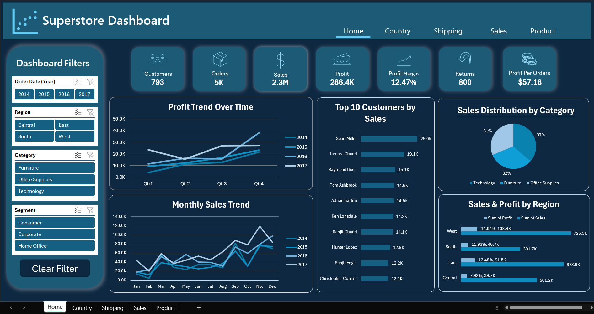
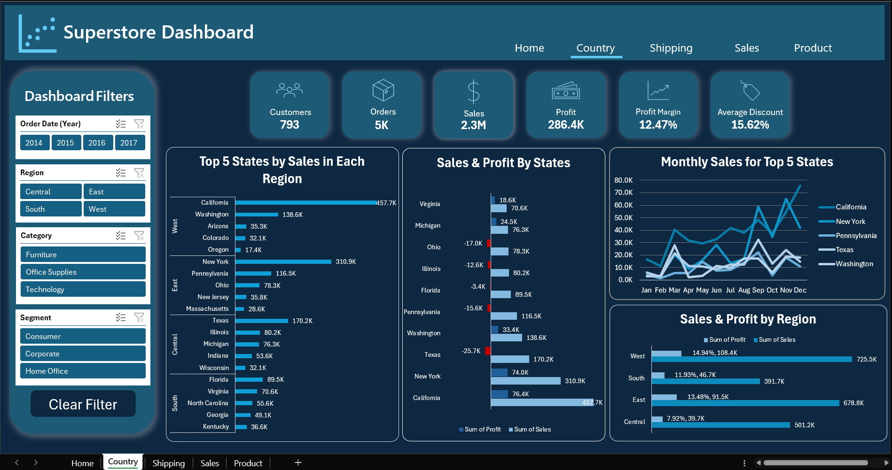
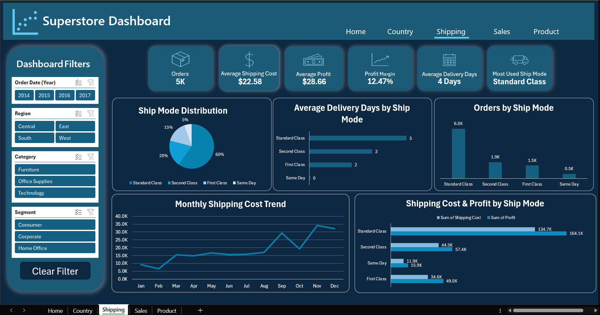
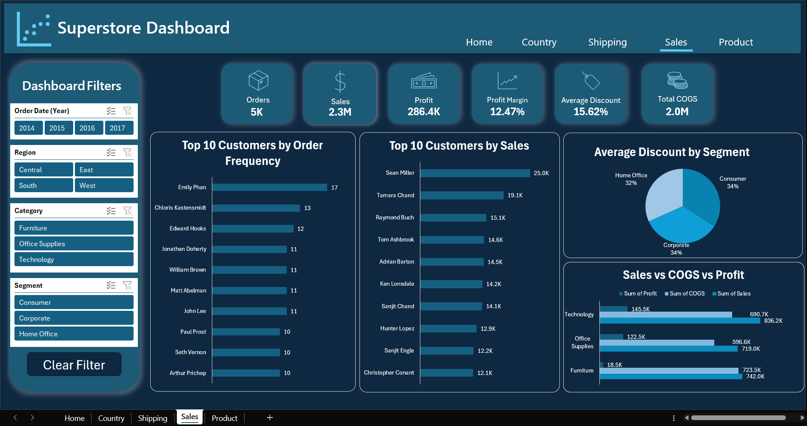
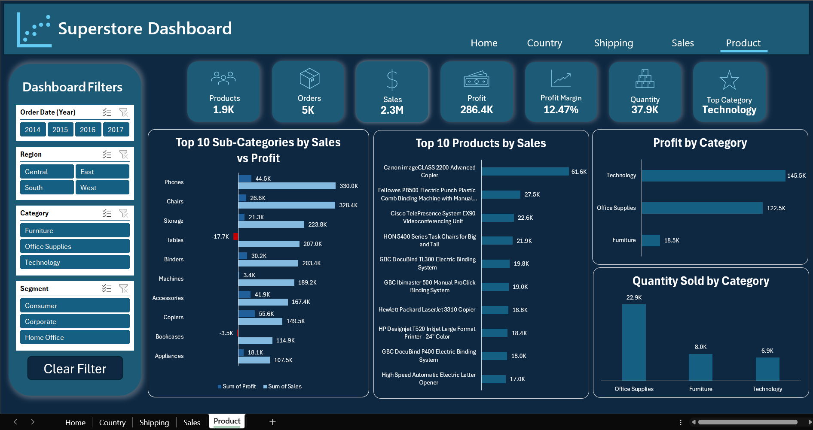

# 📊 Superstore Sales Dashboard (Excel)

An interactive **multi-page Excel dashboard** built to analyze sales, profit, shipping, customer, and product performance using the Superstore retail dataset.

The project demonstrates the complete BI workflow—from **data cleaning and transformation** to **data modeling, DAX calculations, and interactive dashboard design** using Microsoft Excel.

---

# 📷 Dashboard Preview

## 🏠 Home Dashboard



**Overview of business performance including:**
- Total Sales
- Total Profit
- Total Orders
- Total Customers
- Profit Margin
- Sales Distribution
- Monthly Sales Trend
- Top Customers

---

## 🌍 Country Dashboard



Analyze geographic performance through:

- Regional Sales
- State Performance
- Top States
- Sales & Profit by Region
- Monthly Sales Trend

---

## 🚚 Shipping Dashboard



Shipping analysis including:

- Shipping Cost
- Delivery Duration
- Average Profit
- Ship Mode Distribution
- Shipping Cost vs Profit
- Orders by Ship Mode

---

## 💰 Sales Dashboard



Sales analysis including:

- Customer Purchasing Behavior
- Sales vs Profit
- Sales vs COGS
- Average Discount
- Top Customers
- Sales by Segment

---

## 📦 Product Dashboard



Product performance analysis including:

- Top Selling Products
- Sales vs Profit by Sub-Category
- Quantity Sold
- Profit by Category
- Product KPIs

---

# 📊 Dataset

The project uses the classic **Superstore Sales Dataset**.

- Nearly **10,000 sales records**
- Orders
- Customers
- Products
- Returns
- Regions
- Shipping information

Dataset Source:

https://www.kaggle.com/datasets

---

# 💡 Business Insights

During development, I reviewed the data model and rebuilt several calculations to improve reporting quality.

Key findings include:

- Technology generated the highest overall profit.
- Furniture produced high sales but relatively low profitability.
- Some sub-categories generated high revenue while producing negative profit.
- Office Supplies sold the largest quantity of products.
- Shipping cost and delivery performance varied significantly across shipping modes.

---

# 🛠️ Tools & Technologies

## Microsoft Excel

- PivotTables
- PivotCharts
- Dashboard Design
- Slicers
- Timeline Filters
- Conditional Formatting

---

## Power Query

Four queries were built to load and clean the source data:

- **Orders** — the main query, going through **~40 applied steps** (split columns by position/delimiter, merged columns, custom columns, renamed and reordered columns, type conversions) to turn the raw source data into a clean, structured 26-column table
- **Return**, **People**, **Shipping Cost** — smaller lookup queries, cleaned via header promotion and type conversion

Techniques used:

- Data Cleaning
- ETL Process
- Split & Merge Columns
- Custom Columns
- Renamed & Reordered Columns
- Data Type Transformation

---

## Power Pivot

- Data Modeling
- Relationships
- Measures
- Calculated Columns

---

# 🗂️ Data Model

The data model was built in **Power Pivot** using **4 related tables** rather than a single flat table, structured as a **star schema** with Orders as the central fact table:

- **Orders** (fact table) — 26 columns, ~1,000 rows — sales transactions, quantities, discounts, cost, profit
- **Return** — 296 rows, related to Orders via *Order ID* — flagged returned orders
- **People** — 4 rows, related to Orders via *Region* — sales rep per region
- **Shipping_Cost** — 49 rows, related to Orders via *State* — shipping cost per state

**Relationships:** All three lookup tables (Return, People, Shipping_Cost) connect to Orders through standard **one-to-many** relationships, allowing DAX measures to correctly aggregate and filter across the model instead of relying on VLOOKUP/flat merges.

This structure made it possible to build reusable DAX measures (Total Sales, Profit Margin, etc.) that stay accurate across all slicers and dashboard pages, rather than being hardcoded to one table.

---

## DAX

Custom measures built in the model, including:

```dax
Total Customers        = DISTINCTCOUNT(Orders[Customer ID])
Total Orders           = DISTINCTCOUNT([Order ID])
Total Products         = DISTINCTCOUNT(Orders[Product ID])
Total Quantity Sold    = SUM(Orders[Quantity])
Total Orders Returned  = SUM(Orders[Returned])
Avg. Profit            = AVERAGE(Orders[Profit])
Profit Per Customer    = CALCULATE([Total Profit] / [Total Customers])
Profit Per Order       = CALCULATE([Total Profit] / [Total Orders])
```

Along with additional measures for **Total Profit**, **Profit Margin**, **Profit In Florida**, and **Average Delivery Duration**, used to power the KPI cards and charts across all dashboard pages.

---

## VBA

Created a macro to reset every slicer across all dashboard pages with one click.

```vb
Sub Clear_All_Slicers()

    Dim sc As SlicerCache

    For Each sc In ThisWorkbook.SlicerCaches
        sc.ClearManualFilter
    Next sc

End Sub
```

---

# ✨ Dashboard Features

- Interactive multi-page dashboard
- Fully connected slicers across all reports
- Dynamic KPI Cards
- Power Query ETL
- Power Pivot Data Model
- DAX Measures
- VBA Automation
- Responsive PivotCharts
- Business-focused visualizations

---

# 📈 Dashboard Pages

| Page | Description |
|-------|-------------|
| Home | Executive overview of business performance |
| Country | Regional and state analysis |
| Shipping | Shipping performance analysis |
| Sales | Customer and sales analysis |
| Product | Product and sub-category analysis |

---

# 📁 Repository Structure

```
Superstore-Sales-Dashboard
│
├── screenshots
│   ├── Home.png
│   ├── Country.png
│   ├── Shipping.png
│   ├── Sales.png
│   └── Product.png
│
├── Superstore-Sales-Dashboard.xlsm
└── README.md
```

---

# ⚠️ Note

The workbook contains a VBA macro:

```
Clear_All_Slicers
```

Excel may display a security warning when opening the workbook.

Simply click:

**Enable Content**

to activate the **Clear Filter** button.

---

# 💾 Download

Download the workbook:

```
Superstore-Sales-Dashboard.xlsm
```

Open the workbook using **Microsoft Excel** with macros enabled.

---

# 🧠 Skills Demonstrated

- Data Cleaning
- ETL
- Data Modeling
- Data Visualization
- Dashboard Design
- Business Intelligence
- Business Analysis
- DAX
- Power Query
- Power Pivot
- Excel Automation
- VBA

---

# 👨‍💻 Author

**Khaled Nabil**

📧 khalednabil369@gmail.com

💼 LinkedIn

https://www.linkedin.com/in/khaled-nabil-270a95253

---

## ⭐ If you found this project useful, consider giving it a Star.
